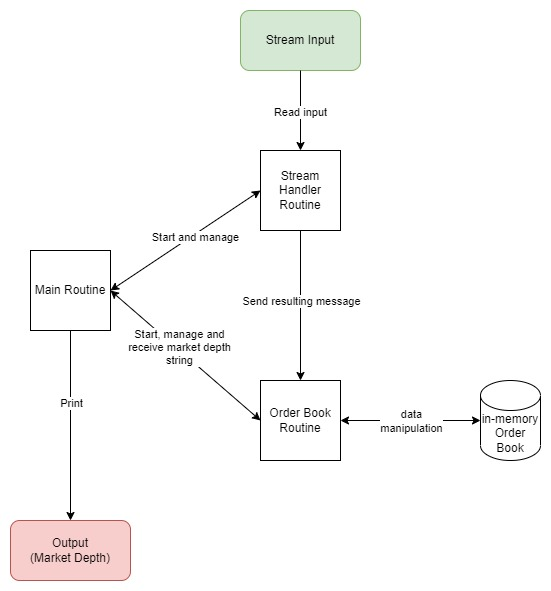

# Order Book

## Dependencies

* Go v1.19 

(tested on Go v1.19.3 and Ubuntu 22.04.01)

## Running the app

to run the app, pipe the stream to the app and specify the depth parameter

example:

```
cat input1.stream | go run main.go -depth=3
```

**note for windows**
the equivalent of `cat` for windows cmd is to use `type` or `Get-Content`, however they will add extra spacing to the read data. Hence, it is not expected to work correctly in windows

### app config

config file is available at `./config`, it can support multiple environment by setting `ENV` environment variable. if not set, by default it will load `dev` config

To load the dev config, set `ENV=dev` e.g.

```
export ENV=dev
```

## Code Design Overview

The app contains 4 main components:
* Main: responsible for starting up the app and managing the other go routines
* StreamHandler: responsible for handling the input stream
* OrderBook: responsible for updating the order book and print out depth
* In-memory DB: stores all the symbol orderIds and market depth



## Tests

### Unit tests

The app unit tests are bootstrapped with Ginkgo for BDD tests

To run the test

```
go test $(go list ./... | grep -v /test) -coverprofile coverage.out
```

use go tool to print out the coverage report

```
go tool cover -func coverage.out
```

### E2e test

The folder `./test` contains the end-to-end test that uses `input1.stream` and `output1.log` as the sample input and expected output

to run the e2e test:

```
go test ./test
```

## Further Improvements

* The input stream might produce data higher than the rate of order book processing. A fan-out pattern could be implemented to increase the processing rate.
* Thread-safe inmemory DB. The current in-memory DB is not thread safe. If we are utilizing the fan-out pattern above, the DB should be implemented with mutex to prevent data race. There will be a performance hit, but this is a necessary trade off. To mitigate the performance hit issue, we can *shard* the inmemory DB so that each symbol is stored in a particular shard to increase performance.
* More unit test coverage. At the moment it is sitting at 50.9% coverage, we should aim for at least 70% coverage
* We might want to persist the Order Book. Using a NoSQL database might be a good solution to store the data as a NoSQL database is easily scaled with sharding.
* Better logging and observability. Currently, the app contains minimal logging and traceability, a better logging/observability solution is required to be able to debug the app in case of errors as it grows
* Support for multiple input streams. Currently, it is only able to handle a single input stream. Multiple input streams handler which can handle and aggregate the data might be of interest
* Add support for windows `type` and `Get-Content`